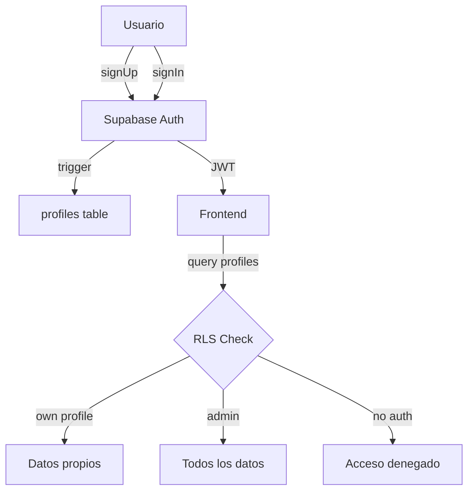

# ADR-001: Arquitectura de Autenticación y Gestión de Usuarios

> **Estado:** Aceptado  
> **Fecha:** 2026-06-09  
> **Decisores:** Fernando Montiel, Agile Orchestrator

---

## Contexto

El sistema montiLibrary requiere autenticación de usuarios y gestión administrativa de cuentas. Se necesita una solución que soporte:
- Registro/login con email y contraseña
- Diferenciación de roles (lector/admin)
- CRUD administrativo de usuarios
- Seguridad a nivel de fila (RLS)

## Decisiones

### 1. Supabase Auth como proveedor de autenticación
- **Decisión:** Usar `supabase.auth` nativo en lugar de implementar auth custom
- **Razón:** Incluye JWT, refresh tokens, email confirmation, password reset out-of-the-box
- **Alternativas descartadas:** Firebase Auth (no compatible con PostgreSQL), Auth0 (costo)

### 2. Tabla `profiles` separada de `auth.users`
- **Decisión:** Crear tabla `public.profiles` vinculada 1:1 con `auth.users`
- **Razón:** `auth.users` es gestionada internamente por Supabase y no se puede modificar su schema. La tabla profiles permite almacenar datos de negocio (nombre, rol, estado)
- **Trigger automático:** `on_auth_user_created` crea el perfil automáticamente al registrarse

### 3. Roles almacenados en `profiles.role` (no en JWT claims)
- **Decisión:** Almacenar el rol en la tabla `profiles` y consultarlo vía RLS/queries
- **Razón:** Cambios de rol se reflejan inmediatamente sin esperar refresh de JWT. Más simple de mantener
- **Trade-off:** Requiere un query adicional al login para obtener el rol

### 4. Soft-delete con campo `is_active`
- **Decisión:** Implementar desactivación (soft-delete) como mecanismo primario, con eliminación permanente como opción secundaria
- **Razón:** Permite reactivar cuentas, mantiene integridad referencial

### 5. Confirmación de email habilitada
- **Decisión:** Habilitar la confirmación de email en el registro
- **Razón:** Mejora la seguridad y calidad de datos de usuarios
- **Testing:** Se usarán bandejas temporales (yopmail.com) para testing

### 6. Campos de perfil obligatorios vs opcionales
- **Decisión:** `first_name` y `last_name` obligatorios; `date_of_birth` y `address` opcionales
- **Razón:** Balance entre información mínima necesaria y experiencia de registro

## Consecuencias

- Todo el equipo frontend debe usar el cliente Supabase para auth
- Las políticas RLS protegen los datos a nivel de DB, no solo en la aplicación
- El frontend debe verificar `is_active` post-login para bloquear usuarios desactivados

