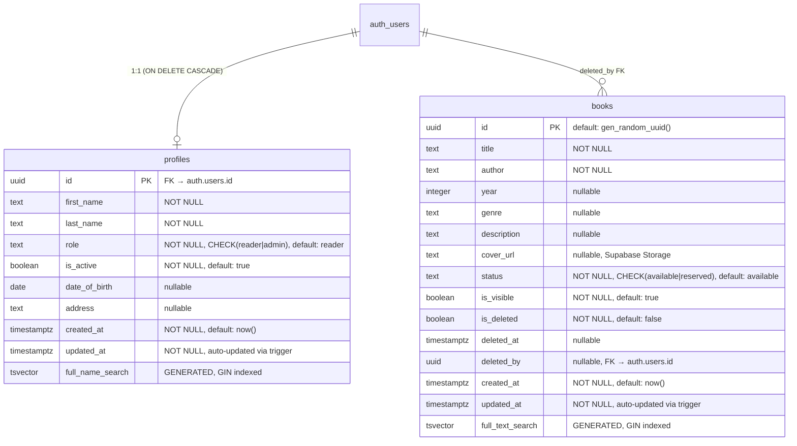

# Migraciones de Base de Datos — montiLibrary

> **Proyecto Supabase:** `ufuqwjhoxmwwezpavnpz`  
> **URL:** `https://ufuqwjhoxmwwezpavnpz.supabase.co`  
> **Fecha:** 2026-06-09

---

## Migración 1: `create_profiles_table`

Crea la tabla `profiles` vinculada 1:1 con `auth.users`, triggers automáticos e índices.

```sql
-- 1. Create profiles table
CREATE TABLE public.profiles (
  id UUID PRIMARY KEY REFERENCES auth.users(id) ON DELETE CASCADE,
  first_name TEXT NOT NULL,
  last_name TEXT NOT NULL,
  role TEXT NOT NULL DEFAULT 'reader' CHECK (role IN ('reader', 'admin')),
  is_active BOOLEAN NOT NULL DEFAULT true,
  date_of_birth DATE,
  address TEXT,
  created_at TIMESTAMPTZ NOT NULL DEFAULT now(),
  updated_at TIMESTAMPTZ NOT NULL DEFAULT now()
);

-- 2. Indexes
CREATE INDEX idx_profiles_role ON public.profiles(role);
CREATE INDEX idx_profiles_is_active ON public.profiles(is_active);
CREATE INDEX idx_profiles_created_at ON public.profiles(created_at DESC);

-- 3. Auto-update updated_at
CREATE OR REPLACE FUNCTION public.handle_updated_at()
RETURNS TRIGGER AS $$
BEGIN
  NEW.updated_at = now();
  RETURN NEW;
END;
$$ LANGUAGE plpgsql SECURITY DEFINER;

CREATE TRIGGER on_profiles_updated
  BEFORE UPDATE ON public.profiles
  FOR EACH ROW
  EXECUTE FUNCTION public.handle_updated_at();

-- 4. Auto-create profile on auth signup
CREATE OR REPLACE FUNCTION public.handle_new_user()
RETURNS TRIGGER AS $$
BEGIN
  INSERT INTO public.profiles (id, first_name, last_name, role, date_of_birth, address)
  VALUES (
    NEW.id,
    COALESCE(NEW.raw_user_meta_data->>'first_name', ''),
    COALESCE(NEW.raw_user_meta_data->>'last_name', ''),
    COALESCE(NEW.raw_user_meta_data->>'role', 'reader'),
    CASE 
      WHEN NEW.raw_user_meta_data->>'date_of_birth' IS NOT NULL 
      THEN (NEW.raw_user_meta_data->>'date_of_birth')::DATE 
      ELSE NULL 
    END,
    NEW.raw_user_meta_data->>'address'
  );
  RETURN NEW;
END;
$$ LANGUAGE plpgsql SECURITY DEFINER;

CREATE TRIGGER on_auth_user_created
  AFTER INSERT ON auth.users
  FOR EACH ROW
  EXECUTE FUNCTION public.handle_new_user();
```

---

## Migración 2: `enable_rls_profiles_policies`

Habilita Row Level Security y crea políticas de acceso basadas en roles.

```sql
ALTER TABLE public.profiles ENABLE ROW LEVEL SECURITY;

-- Users can read their own profile
CREATE POLICY "Users can read own profile"
  ON public.profiles FOR SELECT
  USING (auth.uid() = id);

-- Admins can read all profiles
CREATE POLICY "Admins can read all profiles"
  ON public.profiles FOR SELECT
  USING (
    EXISTS (
      SELECT 1 FROM public.profiles AS p
      WHERE p.id = auth.uid() AND p.role = 'admin'
    )
  );

-- Users can update own profile (cannot change role/is_active)
CREATE POLICY "Users can update own profile"
  ON public.profiles FOR UPDATE
  USING (auth.uid() = id)
  WITH CHECK (
    auth.uid() = id
    AND role = (SELECT role FROM public.profiles WHERE id = auth.uid())
    AND is_active = (SELECT is_active FROM public.profiles WHERE id = auth.uid())
  );

-- Admins can update any profile
CREATE POLICY "Admins can update any profile"
  ON public.profiles FOR UPDATE
  USING (EXISTS (SELECT 1 FROM public.profiles AS p WHERE p.id = auth.uid() AND p.role = 'admin'))
  WITH CHECK (EXISTS (SELECT 1 FROM public.profiles AS p WHERE p.id = auth.uid() AND p.role = 'admin'));

-- Admins can delete profiles
CREATE POLICY "Admins can delete profiles"
  ON public.profiles FOR DELETE
  USING (EXISTS (SELECT 1 FROM public.profiles AS p WHERE p.id = auth.uid() AND p.role = 'admin'));

-- Admins can insert profiles
CREATE POLICY "Admins can insert profiles"
  ON public.profiles FOR INSERT
  WITH CHECK (EXISTS (SELECT 1 FROM public.profiles AS p WHERE p.id = auth.uid() AND p.role = 'admin'));
```

---

## Migración 3: `create_helper_functions_and_seed_admin`

Funciones auxiliares para verificación de estado y rol, búsqueda full-text.

```sql
-- Check if user is active
CREATE OR REPLACE FUNCTION public.is_user_active(user_id UUID)
RETURNS BOOLEAN AS $$
  SELECT COALESCE(
    (SELECT is_active FROM public.profiles WHERE id = user_id),
    false
  );
$$ LANGUAGE sql SECURITY DEFINER STABLE;

-- Get user role
CREATE OR REPLACE FUNCTION public.get_user_role(user_id UUID)
RETURNS TEXT AS $$
  SELECT COALESCE(
    (SELECT role FROM public.profiles WHERE id = user_id),
    'reader'
  );
$$ LANGUAGE sql SECURITY DEFINER STABLE;

-- Full-text search column (generated)
ALTER TABLE public.profiles ADD COLUMN IF NOT EXISTS full_name_search TSVECTOR
  GENERATED ALWAYS AS (
    to_tsvector('spanish', coalesce(first_name, '') || ' ' || coalesce(last_name, ''))
  ) STORED;

CREATE INDEX idx_profiles_full_name_search ON public.profiles USING GIN(full_name_search);
```

---

## Resumen de Políticas RLS

| Política | Operación | Aplica a |
|----------|-----------|----------|
| Users can read own profile | SELECT | Todos los autenticados (solo su perfil) |
| Admins can read all profiles | SELECT | Admins (todos los perfiles) |
| Users can update own profile | UPDATE | Todos (sin cambiar rol ni estado) |
| Admins can update any profile | UPDATE | Admins (cualquier perfil) |
| Admins can delete profiles | DELETE | Admins |
| Admins can insert profiles | INSERT | Admins |

## Diagrama del Schema



---

## Migración 4: `create_books_table`

> **Fecha:** 2026-06-10

Crea la tabla `books` con soporte para soft-delete y búsqueda full-text.

```sql
CREATE TABLE public.books (
  id UUID PRIMARY KEY DEFAULT gen_random_uuid(),
  title TEXT NOT NULL,
  author TEXT NOT NULL,
  year INTEGER,
  genre TEXT,
  description TEXT,
  cover_url TEXT,
  status TEXT NOT NULL DEFAULT 'available' CHECK (status IN ('available', 'reserved')),
  is_visible BOOLEAN NOT NULL DEFAULT true,
  is_deleted BOOLEAN NOT NULL DEFAULT false,
  deleted_at TIMESTAMPTZ DEFAULT NULL,
  deleted_by UUID REFERENCES auth.users(id) DEFAULT NULL,
  created_at TIMESTAMPTZ NOT NULL DEFAULT now(),
  updated_at TIMESTAMPTZ NOT NULL DEFAULT now()
);

-- Indexes
CREATE INDEX idx_books_title ON public.books(title);
CREATE INDEX idx_books_author ON public.books(author);
CREATE INDEX idx_books_status ON public.books(status);
CREATE INDEX idx_books_is_visible ON public.books(is_visible);
CREATE INDEX idx_books_is_deleted ON public.books(is_deleted);
CREATE INDEX idx_books_created_at ON public.books(created_at DESC);

-- Full-text search (Spanish)
ALTER TABLE public.books ADD COLUMN full_text_search TSVECTOR
  GENERATED ALWAYS AS (
    to_tsvector('spanish', coalesce(title, '') || ' ' || coalesce(author, ''))
  ) STORED;
CREATE INDEX idx_books_full_text_search ON public.books USING GIN(full_text_search);

-- Auto-update updated_at (reuses existing function)
CREATE TRIGGER on_books_updated
  BEFORE UPDATE ON public.books
  FOR EACH ROW
  EXECUTE FUNCTION public.handle_updated_at();
```

---

## Migración 5: `enable_rls_books_policies`

> **Fecha:** 2026-06-10

Habilita RLS y crea políticas de acceso para la tabla `books`.

```sql
ALTER TABLE public.books ENABLE ROW LEVEL SECURITY;

CREATE POLICY "Authenticated users can read visible books"
  ON public.books FOR SELECT
  USING (auth.uid() IS NOT NULL AND is_visible = true AND is_deleted = false);

CREATE POLICY "Admins can read all books"
  ON public.books FOR SELECT
  USING (EXISTS (SELECT 1 FROM public.profiles AS p WHERE p.id = auth.uid() AND p.role = 'admin'));

CREATE POLICY "Admins can insert books"
  ON public.books FOR INSERT
  WITH CHECK (EXISTS (SELECT 1 FROM public.profiles AS p WHERE p.id = auth.uid() AND p.role = 'admin'));

CREATE POLICY "Admins can update books"
  ON public.books FOR UPDATE
  USING (EXISTS (SELECT 1 FROM public.profiles AS p WHERE p.id = auth.uid() AND p.role = 'admin'))
  WITH CHECK (EXISTS (SELECT 1 FROM public.profiles AS p WHERE p.id = auth.uid() AND p.role = 'admin'));

CREATE POLICY "Admins can delete books"
  ON public.books FOR DELETE
  USING (EXISTS (SELECT 1 FROM public.profiles AS p WHERE p.id = auth.uid() AND p.role = 'admin'));
```

---

## Migración 6: `create_book_covers_storage`

> **Fecha:** 2026-06-10

Crea el bucket de Storage `book-covers` con políticas de acceso.

```sql
INSERT INTO storage.buckets (id, name, public, file_size_limit, allowed_mime_types)
VALUES ('book-covers', 'book-covers', true, 5242880, ARRAY['image/jpeg', 'image/png', 'image/webp', 'image/gif']);

CREATE POLICY "Public read access for book covers"
  ON storage.objects FOR SELECT USING (bucket_id = 'book-covers');

CREATE POLICY "Admins can upload book covers"
  ON storage.objects FOR INSERT
  WITH CHECK (bucket_id = 'book-covers' AND EXISTS (SELECT 1 FROM public.profiles AS p WHERE p.id = auth.uid() AND p.role = 'admin'));

CREATE POLICY "Admins can update book covers"
  ON storage.objects FOR UPDATE
  USING (bucket_id = 'book-covers' AND EXISTS (SELECT 1 FROM public.profiles AS p WHERE p.id = auth.uid() AND p.role = 'admin'));

CREATE POLICY "Admins can delete book covers"
  ON storage.objects FOR DELETE
  USING (bucket_id = 'book-covers' AND EXISTS (SELECT 1 FROM public.profiles AS p WHERE p.id = auth.uid() AND p.role = 'admin'));
```

## Resumen de Políticas RLS (Actualizado)

### Tabla `profiles`

| Política | Operación | Aplica a |
|----------|-----------|----------|
| Users can read own profile | SELECT | Todos los autenticados (solo su perfil) |
| Admins can read all profiles | SELECT | Admins (todos los perfiles) |
| Users can update own profile | UPDATE | Todos (sin cambiar rol ni estado) |
| Admins can update any profile | UPDATE | Admins (cualquier perfil) |
| Admins can delete profiles | DELETE | Admins |
| Admins can insert profiles | INSERT | Admins |

### Tabla `books`

| Política | Operación | Aplica a |
|----------|-----------|----------|
| Authenticated users can read visible books | SELECT | Autenticados (visible=true, deleted=false) |
| Admins can read all books | SELECT | Admins (todos, incluso ocultos/eliminados) |
| Admins can insert books | INSERT | Admins |
| Admins can update books | UPDATE | Admins |
| Admins can delete books | DELETE | Admins |

### Storage `book-covers`

| Política | Operación | Aplica a |
|----------|-----------|----------|
| Public read access | SELECT | Todos |
| Admins can upload | INSERT | Admins |
| Admins can update | UPDATE | Admins |
| Admins can delete | DELETE | Admins |

